# Project 3: Talent Hub
Talent Hub is a web application which allows a company to create a profile to uplaod job applications and applications to browse and apply for the uploaded jobs. 

## Table of Contents

TBC

## Project Goals 
This web application will allow users to upload or view job applications that are posted to the site. A user can sign up as a company or a candidate and then use the features. 

### User Goals
Users have the following goals: 
* Browse uploaded jobs 
* Upload a new job
* Submit an application 
* View the applications 

### Site Goals
Site managers have the following goals: 
* View which jobs are being posted 
* Maintain a database of companies 

## User Experience
This section shows the considerations for each type of user that would use the website and the experiences they would have.

### Target Audience 
The target audience is a user which would like to apply for a job in technology consulting or a user which would like to upload a job for the technology consultnacy. 

### Expectations 
Users of the site can expect:
* Easy to use navigation
* Clear layout
* Links to everything described
* Responsiveness to view the site on any device

### User Stories
The following users and their user stories have been considered: 

|User ID|User|Goal|Stories|
|:-----|:-------|:-------------|:-------|
|User 1|Visitor|Browse uploaded jobs anonymously|<ul><li>As a visitor, I want to see a list of active job postings so I can decide whether to register.</li><li>As a visitor, I want to view full details of a single job so I understand what's required before signing up.</li><li>As a visitor, I want to register as either a Company or a Candidate so I can access the right dashboard.</li><li>As a visitor, I want to be redirected sensibly (not a broken page) if I try to access a protected page.</li></ul>|
|User 2|Candidate|Register to the site and submit applications|<ul><li>As a candidate, I want to create a profile with my name, skills, and a short CV summary so companies can understand my background.</li><li>As a candidate, I want to edit my profile so I can keep it up to date.</li><li>As a candidate, I want to search/filter jobs by keyword, location, or job type so I can find relevant roles quickly.</li><li>As a candidate, I want to apply to a job with a short cover note so I can express my interest.</li><li>As a candidate, I want to be prevented from applying to the same job twice so my application list stays clean.</li><li>As a candidate, I want to see a list of jobs I've applied to and their current status so I can track my progress.</li><li>As a candidate, I want to withdraw an application I no longer want to pursue.</li><li>As a candidate, I want clear confirmation when my application is submitted so I know it worked.</li></ul>|
|User 3|Company|Register to the site and post jobs|<ul><li>As a company, I want to create a company profile (name, description, website) so candidates know who's hiring.</li><li>As a company, I want to post a new job listing with title, description, location, salary range, and type so candidates can evaluate it.</li><li>As a company, I want to edit or deactivate my own job listings so I can keep them current.</li><li>As a company, I want to be prevented from editing or deleting another company's job listing</li><li>As a company, I want to view all applicants for a specific job so I can review candidates.</li><li>As a company, I want to update an applicant's status so candidates know where they stand.</li><li>As a company, I want confirmation and feedback whenever I post, edit, or delete a job.</li> </ul>|
|User 4|Admin|Manage the site|<ul><li>As an admin, I want to manage all users, companies, jobs, and applications via the Django admin so I can moderate the platform if needed.</li></ul>|

## Design
This section shows the design choices I made as part of the design of this website, alongside wireframes to show the rough layout of each page before construction of the website. Through all these choices, I have considered the 5 planes of user experience to ensure a smooth and enjoyable experience for all users of the site.

### Fonts, Colours and Structure
The colour theme of this site is as follows:

|Colour|Hex Code|Description   |
|:-----|:-------|:-------------|
|Off-white|#FAF9F6|Primary Background Colour|
|Talent Hub Red|#C00000|Primary Colour|
|Muted Grey|#D9D9D9|Secondary Colour|
|Teal|#009098|Primary Accent Colour|
|Pastel Teal|#99D3D6|Secondary Accent Colour|
|Pastel Talent Hub Red|#FFD5D5|Selection Colour|
|Charcoal|#3D3D3C|Primary Text Colour|
|Grey|#8D8D8B|Border Colour|

Using this [contrast evaluator](https://coolors.co/contrast-checker/3d3d3c-faf9f6), the background colour and text colour have a contrast score of 10.33 which is rated very good, and the background colour and primary colour have a contrast score of 6.15 which is acceptible due to this being used graphically rather than for text. 

There are two fonts used through this site:

1. Hanken Grotesk will be used for headers and key text. 
2. Inter will be used for blocks of text and information.

The site will have the following pages: 

1. Job Listing page which has a paginated overview of all roles and the option to filter your search. 
2. A job details page which will show all information available and that role 
3. A company dashboard which will show you applications for a role you have posted 
4. An applicant dashboard which will allow users to see how their application is progressing (DO I NEED THIS OR SHOULD I JUST USE EMAIL)
5. A log in and account registration page to allow users to sign up in either role

### Wireframes
This section shows the wireframes for each page created in this web application across mobile, tablet and desktop screens. 

#### Home Page 
This page shows all job listings and is accessible without a log in. 

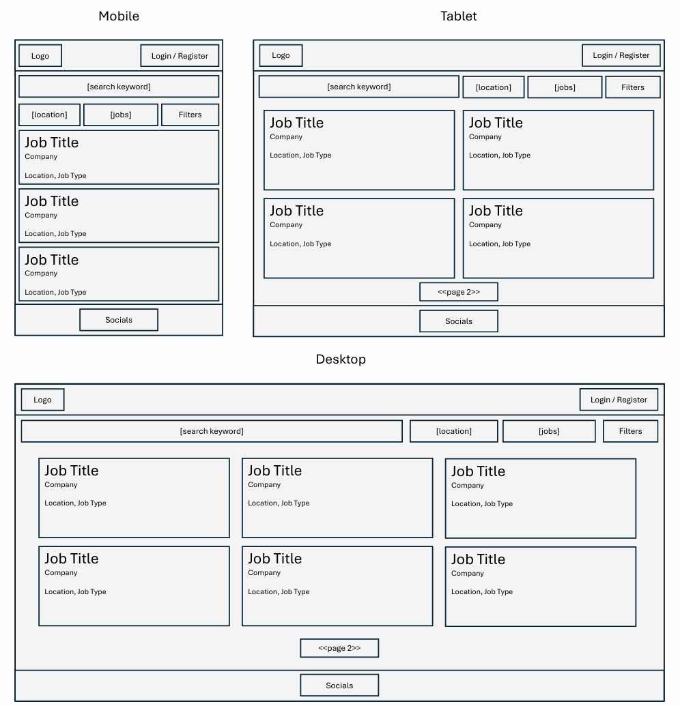

#### Job Listing 
This page shows all the details of a selected job and is accessible without a log in. 

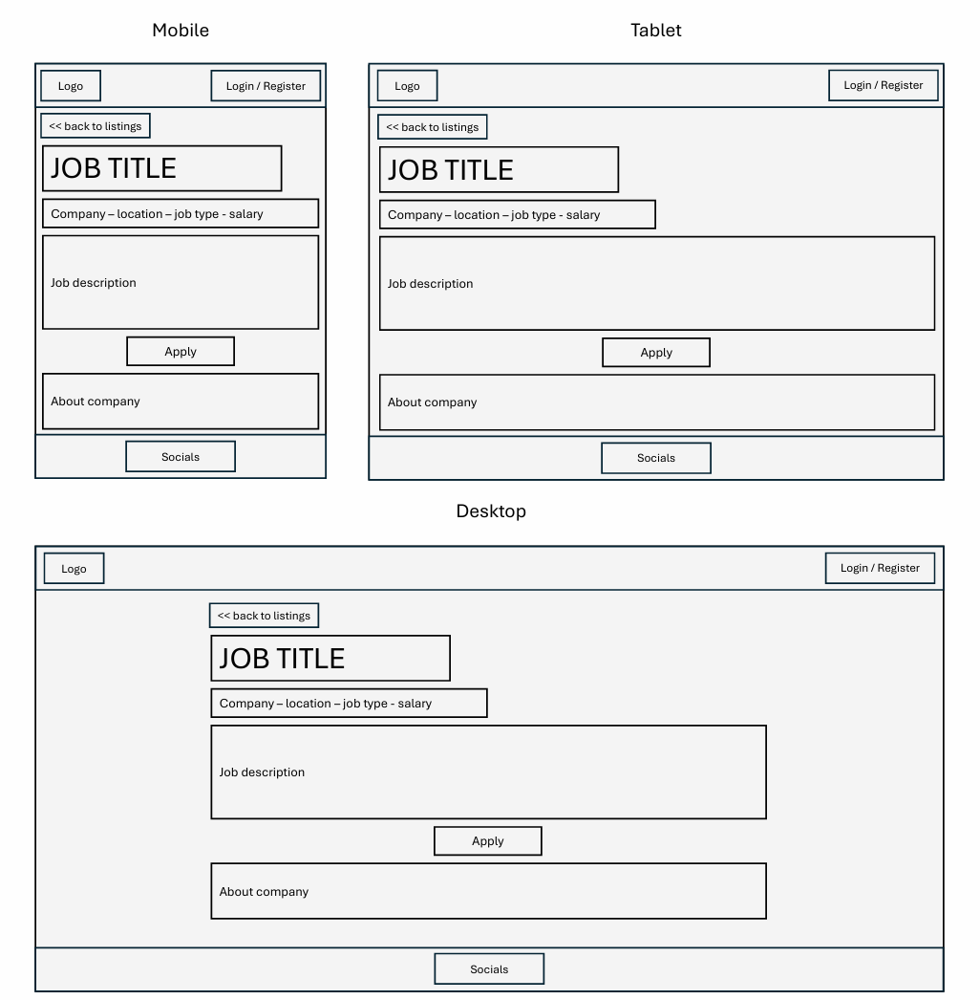

To select apply you will be prompted to log in if not already. When logged in, a model will auto-populate with candidate information from their profile and additional questions to fill out set by the company. 

#### Company Dashboard
This page shows all job listings for a company and applicants which have applied. 

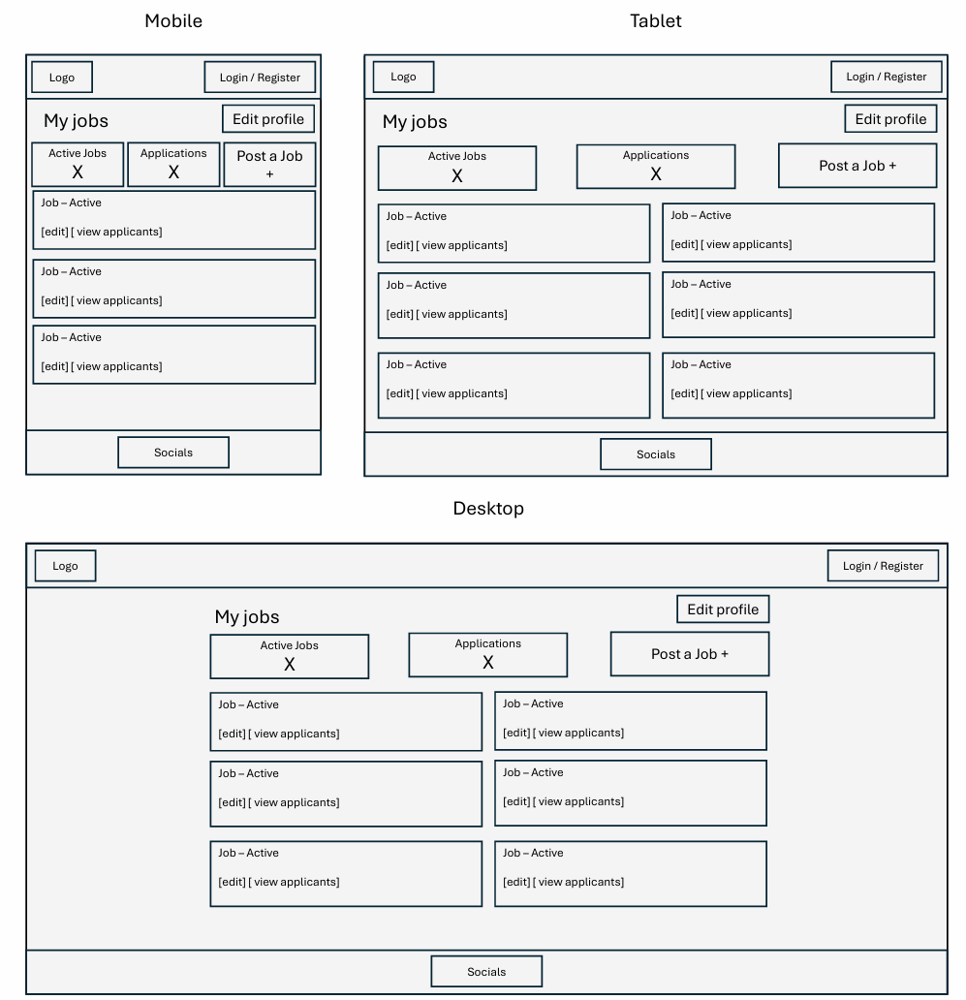

#### Applications for a specific role 
This page shows applicants for a specific role. 

#### Candidate Dashboard 
This page shows all the roles a candidate has applied for, the status and the option to withdraw. 

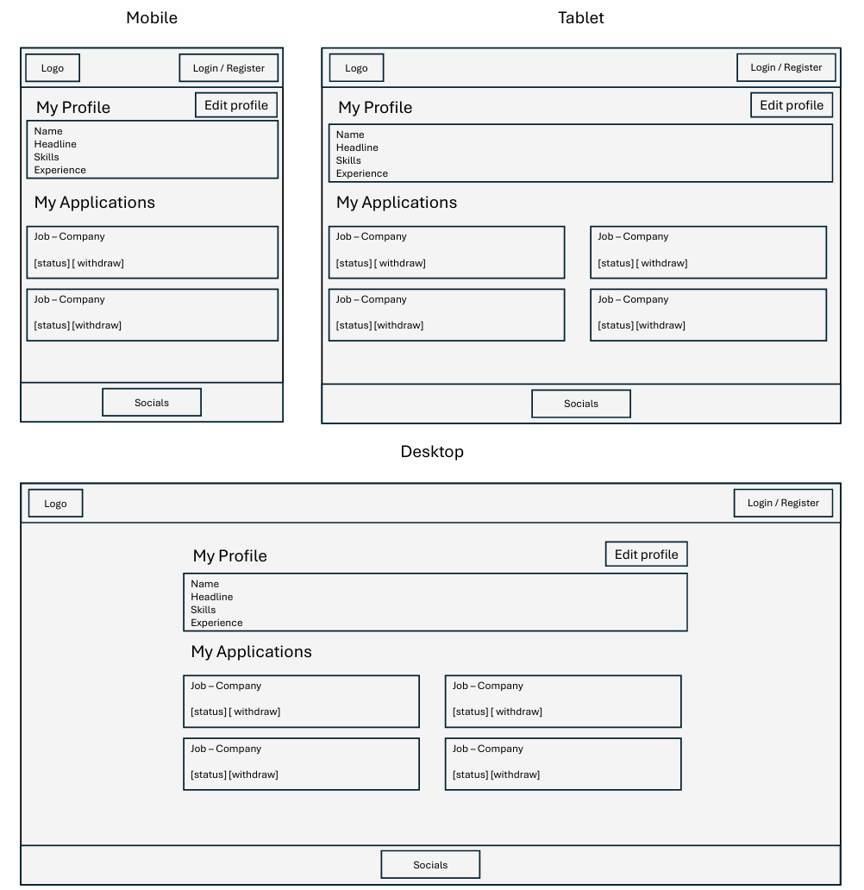

## Frameworks & Languages
This section highlights all the languages and frameworks used in this project. 

The following languages are used in this project: 

* HTML
* CSS
* Python
* Javascript

The following frameworks are used in this project: 

* Django 6.1.1
* Bootstrap v5.3.8
* Github
* Google Fonts 
* Font Awesome 

The application is deployed using Heroku. 

## Data Model
In this project, my application will utilise a PostgreSQL data base provided by the Code Instutute. I have created the following tables and provided a graphical representation of how they are connected. 

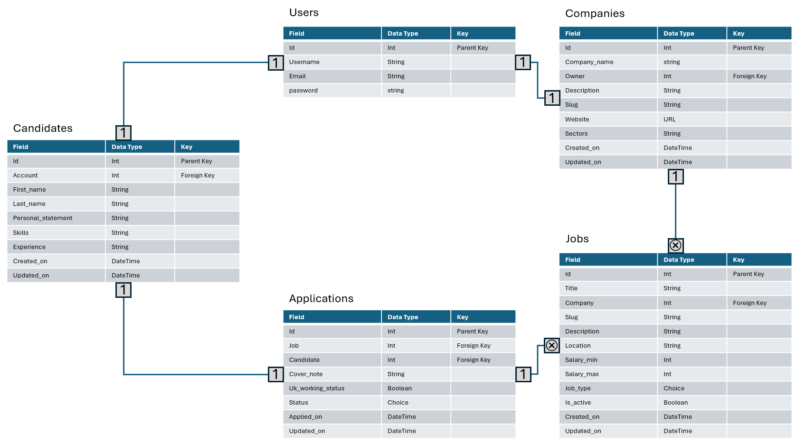

|Table|Description|
|:------|:-----------|
|Users|The Users table will contain user information be created through Django authentication. |
|Candidates|The Candidates table will contain information related to each candidate that would apply to the job application.|
|Applications|The Applications table will contain information for which candidate has applied to which opportunity. |
|Jobs|The Jobs table will contain information related to each job a company has posted that can be viewed by the applicants.|
|Companies|The Companies table will contain information related to the company that can be viewed by the applicants.|

Relationships are shown by the lines joining the tables, with a 1 on each end meaining a one-to-one connection and a 1 and a cross on the end meaning a one-to-many connection.

## Features 
This section outlines key features on each page. 

### Common Features 
Common features appear across all pages. 

#### Navigation Bar
The navigation bar is featured on all pages and aims to apply consistant styling and positon for all users, built with responsive design. The navigation bar displays different options based on a users authentication. 

* For no authentication, users will see one option to see available jobs and the option to log in or register
* For candidates who are authenticated, they can view the job list, their applications and edit their profile. They also have the option to log out.
* For companies, they can view the available jobs and their job dashboard. They also have the option to log out.

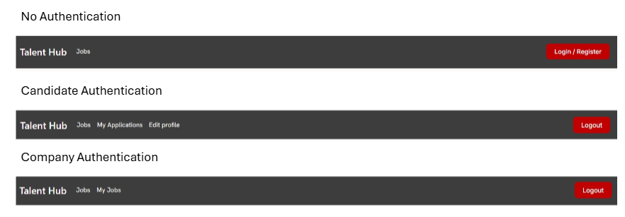

#### Footer

The footer features links to key social media sites. 

### Job List
The home page features a header with some information, followed by multiple search fields which can filter the job cards below. Each card holds key information about a role, including title, company, location and maximum salary. There is an arrow link to see more details. 

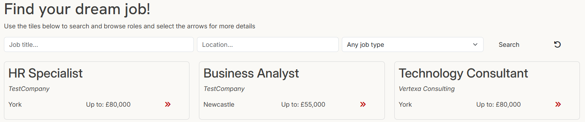

### Job Details
Once a user has selected a job card, they will be taken to a page showing the full job listing. Each job listing has a back button to take users back to the home page, the role title, key information displayed at the top and then the full job desription. Further down the page is information about the hiring company, and where provided a link to the companies website. 

The user will also have different options available depending on their authentication and role. 

* If a user is not authenticated, there will be no options to go any further in the application. 
* If a user is authenticated as a candidate, there will be the 'Apply' button. Selecting this button will bring up a modal which will allow the user to write a cover note, select their working status and submit their application. 
* If a user is authenticated as the company which owns the job listing, they will have the option to edit the role or view applications to the role
* If a user is authenticated as a company which does not own the job listing, they will not see any buttons. 

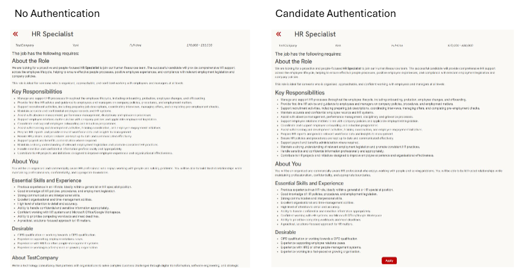
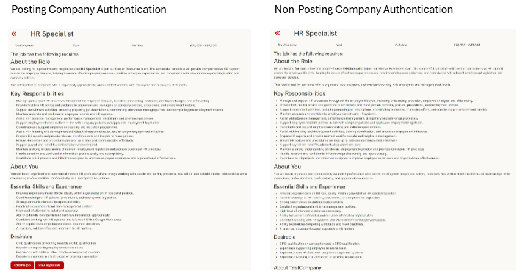

### Company Dashboard 
The company dashboard is only available to users which are classfied as a company. The user has access to the following features: 

* A count of active jobs 
* The number of applications to their roles 
* The option to post a new job listing 
* Tiles for each role with the view to edit the role or view the applications to the role

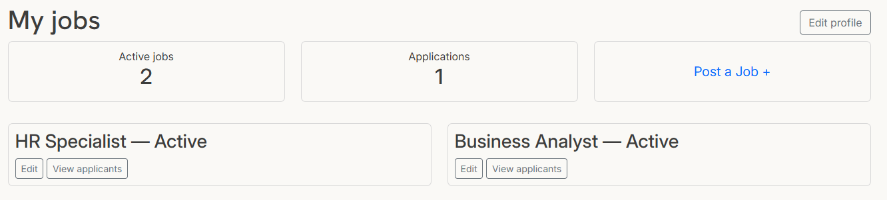

### Job Listing Application List
The application list for a role is only available to users which are classified as a company. The user has access to the following features: 

* A list of applicants to the role 
* Further details such as their working status and the date they applied on
* A status field which is a drop down that updates the status of the application 
* A see more button per applicant which displays their full application in a modal

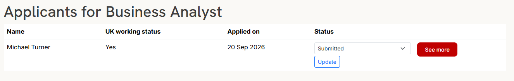

### Applicant Dashboard 
The applicant dashboard is only availablto users which are classified as a candidate. The user has access to the following features: 

* A view of all roles the user has applied to
* The status of the users application 
* The date the user applied to the job listing 
* A link to view the job listing 
* The option to withdraw their application

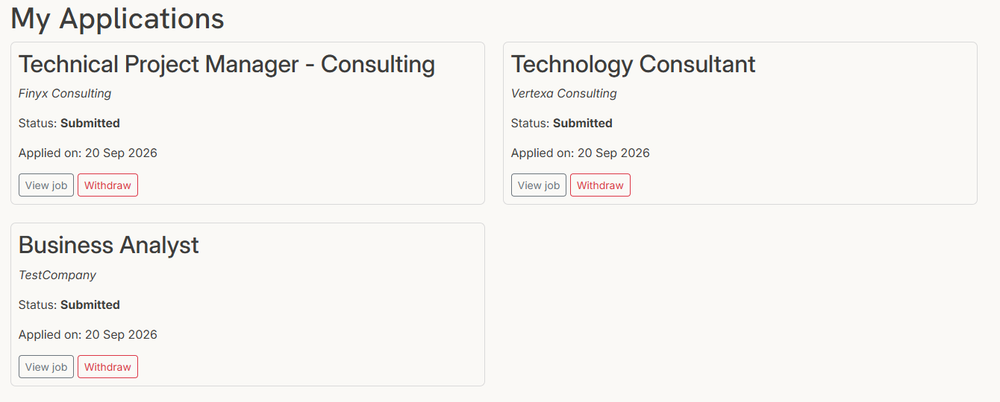

### Edit Forms
All edit forms across the project follow a similar format, with summernote used for rich text inputs. 

* Candidate users will be able to access the edit profile form to update their skills
* Company users will be able to access the edit profile form and the edit / post a job form

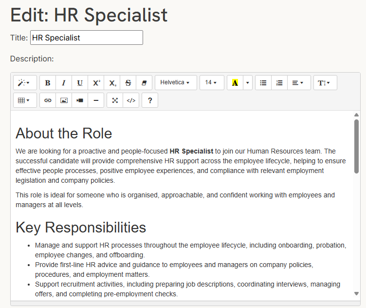

### Authentication 
Modifying allauth's base templates, there are signup, sign in and log out pages matching the style of this web application.

## Testing 
I have tested my project through a combination of manual testing of user stories, Django testing and tooling. Each section will explain how this is done. 

### User Story Testing 
Testing was carried out against the deployed Heroku site to confirm the deployed version matches the tested development version. Each user story from the design documentation is tested individually below.

#### User 1: Visitor
 
| # | Story | Test steps | Expected result | Status |
|---|---|---|---|---|
| 1.1 | As a visitor, I want to see a list of active job postings so I can decide whether to register. | Visit the site while logged out. | Job list page loads showing only jobs where `is_active=True`. | Pass | 
| 1.2 | As a visitor, I want to view full details of a single job so I understand what's required before signing up. | Click through from the job list to a job's detail page. | Full job detail displays: title, company, location, salary, description, job type. | Pass | 
| 1.3 | As a visitor, I want to register as either a Company or a Candidate so I can access the right dashboard. | Visit signup page, select "Company," complete form. Repeat for "Candidate." | Correct `Companies`/`Candidate` profile row created and linked to the new `User` in each case. | Pass | 
| 1.4 | As a visitor, I want to be redirected sensibly if I try to access a protected page. | While logged out, visit `/applications/my-applications/` directly. | Redirected to login page, not a broken page or server error. | Pass |  
 
 
#### User 2: Candidate
 
| # | Story | Test steps | Expected result | Status |
|---|---|---|---|---|
| 2.1 | As a candidate, I want to create a profile with my name, skills, and a short CV summary. | Sign up as a Candidate. | Candidate profile row created with correct linked `User`. | Pass |  
| 2.2 | As a candidate, I want to edit my profile so I can keep it up to date. | Log in as Candidate, visit edit profile page, update fields, save. | Changes persist on reload; visible correctly to companies reviewing an application. | Pass |  
| 2.3 | As a candidate, I want to search/filter jobs by keyword, location, or job type. | Use the search form with keyword only, location only, job type only, and combined. | Results correctly narrow in each case; combined filters use AND logic. | Pass |  
| 2.4 | As a candidate, I want to apply to a job with a short cover note. | Log in as Candidate, open a job's Apply modal, submit a cover note and working status. | `Application` row created, correctly linked to the job and candidate; status defaults to "Submitted." | Pass |  
| 2.5 | As a candidate, I want to be prevented from applying to the same job twice. | Apply to the same job a second time. | Friendly message shown ("You've already applied..."); no duplicate row created; no server error. | Pass | 
| 2.6 | As a candidate, I want to see a list of jobs I've applied to and their current status. | Visit "My Applications" after applying to one or more jobs. | All of the candidate's own applications shown, each with correct job title, company, and status. Applications belonging to other candidates are never shown. | Pass |  
| 2.7 | As a candidate, I want to withdraw an application I no longer want to pursue. | From "My Applications," withdraw an application with status "Submitted" or "Shortlisted." | Status changes to "Withdrawn"; row remains visible (not deleted); Withdraw button no longer shown for that row. | Pass |  
| 2.8 | As a candidate, I want clear confirmation when my application is submitted. | Submit an application. | Redirect to my applicatons dashboard | Pass |  
| — | *(Negative test, not a stated story but a related permission check)* | Log in as Candidate, attempt to visit `/jobs/post/` directly. | `PermissionDenied` (403) — candidates cannot post jobs. | Pass |  
 

#### User 3: Company
 
| # | Story | Test steps | Expected result | Status |
|---|---|---|---|---|
| 3.1 | As a company, I want to create a company profile (name, description, website). | Sign up as a Company. | Companies profile row created with correct linked `User`. | Pass |  
| 3.2 | As a company, I want to post a new job listing with title, description, location, salary range, and type. | Log in as Company, use "Post a Job" form. | New `Job` row created, correctly linked to the company; appears on public job list (if active). | Pass|  
| 3.3 | As a company, I want to edit or deactivate my own job listings. | Edit an owned job's details; separately, set `is_active` to False. | Changes save correctly; deactivated job disappears from the public job list and its detail page 404s for visitors. | Pass |  
| 3.4 | As a company, I want to be prevented from editing or deleting another company's job listing. | Log in as Company B, attempt to visit Company A's job edit URL directly. | `PermissionDenied` (403). | Pass |  
| 3.5 | As a company, I want to view all applicants for a specific job. | Log in as Company, click "View applicants" on an owned job. | Table of applicants for that job only, with name, skills, working status, applied date, status control. | Pass |  
| 3.6 | As a company, I want to update an applicant's status. | Change an applicant's status via the dropdown/update control. | Status updates immediately; reflected on reload for both company and candidate views. | Pass |  
| 3.7 | As a company, I want confirmation and feedback whenever I post, edit, or delete a job. | Post a job; edit a job; update an application status. | Success message shown after each action. | Pass |  
| — | *(Negative test)* | Log in as Company B, attempt to visit Company A's "review applicants" URL directly. | `PermissionDenied` (403). | Pass |  
| — | *(Negative test)* | Log in as Candidate, attempt to visit `/companies/dashboard/` or `/companies/profile/edit/` directly. | `PermissionDenied` (403). | Pass |  
 

 
#### User 4: Admin
 
| # | Story | Test steps | Expected result |  Status |
|---|---|---|---|---|
| 4.1 | As an admin, I want to manage all users, companies, jobs, and applications via the Django admin. | Log in to `/admin/` as a superuser. | All models (User, Companies, Candidate, Job, Application) visible and editable; can view/edit any record regardless of ownership. | Pass |
 
#### Cross-cutting checks (not tied to a single story)
 
| # | Area | Test steps | Expected result |  Status |
|---|---|---|---|---|
| C.1 | Responsive design | View job list, job detail, dashboard, and application review pages at mobile, tablet, and desktop widths. | Layout adapts correctly at each breakpoint; no horizontal scrolling or broken layout. | Pass | 
| C.2 | Deployed vs dev parity | Repeat key stories above (1.1–3.7) against the live Heroku URL. | Deployed site behaves identically to local development version. | Pass |  
| C.3 | Security — DEBUG | Check Heroku config vars. | `DEBUG=False` on the deployed app. | Pass |  
| C.4 | Security — secrets | Review `.gitignore` and git history. | No `SECRET_KEY`, passwords, or `.env` contents committed to the repository. | Pass |  
| C.5 | Broken links / navigation | Click through every nav link, footer link, and back button while logged out, as Candidate, and as Company. | No broken links or unexpected errors for any role. | Pass |  

### Lighthouse Testing 

### HTML

### CSS

### Django TestCase 
I have used the Django testing framework on two of the four applications in this project. 

#### Jobs Testing
The following tests have been ran and passed for the jobs application: 

1. An anonmyous visitor should be redirected to login when navigating to the job posting form
2. A logged in candidate user is denied access to the job posting form
3. A logged in company user can access the job posting form
4. A logged in company user can access the edit job form for its own job listings 
5. A logged in company user cannot edit the job of a different company 
6. A job marked as 'not active' is not displayed on the home page or accessible via URL
7. A job marked as 'active' is displayed on the home page 

#### Applications Testing
The following tests have been ran and passed for the applications application: 

1. A logged in company user cannot apply to a job listing 
2. A logged in candidate user can apply for a job 
3. A logged in candidate user cannot apply for the same job twice 
4. A logged in company user can view the application list for its own job 
5. A logged in company user can only see applications for their own job listings 
6. Withdrawing an application marks it as withdrawn, but keeps the datarow
7. A logged in candidate user cannot withdraw another candidates application 

## Bugs
The following bugs occured during the design of this site: 

|ID|Bug|Fix   |
|:-----|:-------|:-------------|
|1|Auth additional question was not working and adding data to the database.|Needed to update logic and fix a typo in the model|
|2|Back button pathing from job page erroring.|All urls needed distinct names|
|3|Could not submit a job application.|Set account as a forein key rather than a one to one field to ensure django expects a unique value|
|4|when logged in as a company, updating the status would cause an error.|The STATUS_CHOICES variable needed to be imported into the view to be used. |
|5|favicon not showing.|Needed to add to right static folder|
|6|redirect on submitting duplicate job entry|Navbar was hiding the alert pop up so fixed by changing ti sticky-top bootstrap class.|
|7|users signing up as companies are not mapping properly.|Updated Companies.save() to guard against slugify() returning an empty string, and to check for slug collisions explicitly|

## Deployment 
For the version control, deployment and hosting of this site I have used Github and Heroku. 

### Cloning the Repository 
To take your own version of this repository, you will have to use the following steps: 

1. Select the fork buttn in the top right corner of the repository and add to your own 
2. Clone the reposiotry using the green 'Code' button 
3. Copy the repository URL to your clipboard
4. Open your terminal and run: git clone [REPOSITORY URL] 
5. Change int othe project directory 

This should mean you have a local copy of the repository to edit. 

### Deploying to Heroku
The live version of this site is hosted using Heroku. To deploy your own version of the application, you need to use the following steps: 

1. Set up a Heroku account and log in
2. Select 'New' in the top right and create new app
3. Name your app and choose the correct region before selecting create app 
4. Edit the config vars section within the settings tab with your unique SECRET_KEY, DATABASE_URL and any other unique variables you have incldued in your project
5. In the deploy tab, choose GitHub as your deployment method 
6. Choose the correct repository and ensure the correct branch is selected (ususally main)
7. Use the 'deploy branch' button in the manual deployments section and let this run
8. Use the open app button to launch the application

Please note, within your allowed hosts within settings.py of your application, you should have '.herokuapp.com' or else this will not deploy. 

## Code from External Sources 
The following packages have been used in this project, and are also listed in requirements.txt: 

* asgiref 3.12.1
* bleach 6.4.0
* dj-database-url 3.1.2
* Django 6.1.1
* django-allauth 65.19.2
* django-environ 0.14.0
* django-summernote 0.8.20.0
* gunicorn 26.2.0
* psycopg2-binary 2.9.12
* sqlparse 0.6.0
* tzdata 2026.3
* webencodings 0.6.1
* whitenoise 6.12.0

## Credits and Disclaimer 
I have the following credits and disclamer: 

* My favicon is from here <a href="https://www.flaticon.com/free-icons/recruitment" title="recruitment icons">Recruitment icons created by Md Tanvirul Haque - Flaticon</a>
