# Talent Hub Test File
This section covers testing completed in relation to this project. 

## Table of Contents
Please use the links below to navigate to a specific section: 

* [User Story Testing](#user-story-testing)
* [Responseness Testing](#responsiveness-testing)
* [Lighthouse Testing](#lighthouse-testing)
* [HTML Testing](#html-testing)
* [CSS Testing](#css-tetsing)
* [Django Testing](#django-testcase)

## User Story Testing 
Testing was carried out against the deployed Heroku site to confirm the deployed version matches the tested development version. Each user story from the User Experience section is tested individually below.

### User 1: Visitor
 
| # | Story | Test steps | Expected result | Status |
|---|---|---|---|---|
| 1.1 | As a visitor, I want to see a list of active job postings so I can decide whether to register. | Visit the site while logged out. | Job list page loads showing only jobs where `is_active=True`. | Pass | 
| 1.2 | As a visitor, I want to view full details of a single job so I understand what's required before signing up. | Click through from the job list to a job's detail page. | Full job detail displays: title, company, location, salary, description, job type. | Pass | 
| 1.3 | As a visitor, I want to register as either a Company or a Candidate so I can access the right dashboard. | Visit signup page, select "Company," complete form. Repeat for "Candidate." | Correct `Companies`/`Candidate` profile row created and linked to the new `User` in each case. | Pass | 
| 1.4 | As a visitor, I want to be redirected sensibly if I try to access a protected page. | While logged out, visit `/applications/my-applications/` directly. | Redirected to login page, not a broken page or server error. | Pass |  
 
### User 2: Candidate
 
| # | Story | Test steps | Expected result | Status |
|---|---|---|---|---|
| 2.1 | As a candidate, I want to create a profile with my name, skills, and a short CV summary. | Sign up as a Candidate. | Candidate profile row created with correct linked `User`. | Pass |  
| 2.2 | As a candidate, I want to edit my profile so I can keep it up to date. | Log in as Candidate, visit edit profile page, update fields, save. | Changes persist on reload; visible correctly to companies reviewing an application. | Pass |  
| 2.3 | As a candidate, I want to search/filter jobs by keyword, location, or job type. | Use the search form with keyword only, location only, job type only, and combined. | Results correctly narrow in each case; combined filters use AND logic. | Pass |  
| 2.4 | As a candidate, I want to apply to a job with a short cover note. | Log in as Candidate, open a job's Apply modal, submit a cover note and working status. | `Application` row created, correctly linked to the job and candidate; status defaults to "Submitted." | Pass |  
| 2.5 | As a candidate, I want to be prevented from applying to the same job twice. | Apply to the same job a second time. | Friendly message shown ("You've already applied..."); no duplicate row created; no server error. | Pass | 
| 2.6 | As a candidate, I want to see a list of jobs I've applied to and their current status. | Visit "My Applications" after applying to one or more jobs. | All of the candidate's own applications shown, each with correct job title, company, and status. Applications belonging to other candidates are never shown. | Pass |  
| 2.7 | As a candidate, I want to withdraw an application I no longer want to pursue. | From "My Applications," withdraw an application with status "Submitted" or "Shortlisted." | Status changes to "Withdrawn"; row remains visible (not deleted); Withdraw button no longer shown for that row. | Pass |  
| 2.8 | As a candidate, I want clear confirmation when my application is submitted. | Submit an application. | Redirect to my applicatons dashboard | Pass |  
| — | *(Negative test, not a stated story but a related permission check)* | Log in as Candidate, attempt to visit `/jobs/post/` directly. | `PermissionDenied` (403) — candidates cannot post jobs. | Pass |  
 
### User 3: Company
 
| # | Story | Test steps | Expected result | Status |
|---|---|---|---|---|
| 3.1 | As a company, I want to create a company profile (name, description, website). | Sign up as a Company. | Companies profile row created with correct linked `User`. | Pass |  
| 3.2 | As a company, I want to post a new job listing with title, description, location, salary range, and type. | Log in as Company, use "Post a Job" form. | New `Job` row created, correctly linked to the company; appears on public job list (if active). | Pass|  
| 3.3 | As a company, I want to edit or deactivate my own job listings. | Edit an owned job's details; separately, set `is_active` to False. | Changes save correctly; deactivated job disappears from the public job list and its detail page 404s for visitors. | Pass |  
| 3.4 | As a company, I want to be prevented from editing or deleting another company's job listing. | Log in as Company B, attempt to visit Company A's job edit URL directly. | `PermissionDenied` (403). | Pass |  
| 3.5 | As a company, I want to view all applicants for a specific job. | Log in as Company, click "View applicants" on an owned job. | Table of applicants for that job only, with name, skills, working status, applied date, status control. | Pass |  
| 3.6 | As a company, I want to update an applicant's status. | Change an applicant's status via the dropdown/update control. | Status updates immediately; reflected on reload for both company and candidate views. | Pass |  
| 3.7 | As a company, I want confirmation and feedback whenever I post, edit, or delete a job. | Post a job; edit a job; update an application status. | Success message shown after each action. | Pass |  
| — | *(Negative test)* | Log in as Company B, attempt to visit Company A's "review applicants" URL directly. | `PermissionDenied` (403). | Pass |  
| — | *(Negative test)* | Log in as Candidate, attempt to visit `/companies/dashboard/` or `/companies/profile/edit/` directly. | `PermissionDenied` (403). | Pass |  
 
### User 4: Admin
 
| # | Story | Test steps | Expected result |  Status |
|---|---|---|---|---|
| 4.1 | As an admin, I want to manage all users, companies, jobs, and applications via the Django admin. | Log in to `/admin/` as a superuser. | All models (User, Companies, Candidate, Job, Application) visible and editable; can view/edit any record regardless of ownership. | Pass |
 
### Cross-cutting checks (not tied to a single story)
 
| # | Area | Test steps | Expected result |  Status |
|---|---|---|---|---|
| C.1 | Responsive design | View job list, job detail, dashboard, and application review pages at mobile, tablet, and desktop widths. | Layout adapts correctly at each breakpoint; no horizontal scrolling or broken layout. | Pass | 
| C.2 | Deployed vs dev parity | Repeat key stories above (1.1–3.7) against the live Heroku URL. | Deployed site behaves identically to local development version. | Pass |  
| C.3 | Security — DEBUG | Check Heroku config vars. | `DEBUG=False` on the deployed app. | Pass |  
| C.4 | Security — secrets | Review `.gitignore` and git history. | No `SECRET_KEY`, passwords, or `.env` contents committed to the repository. | Pass |  
| C.5 | Broken links / navigation | Click through every nav link, footer link, and back button while logged out, as Candidate, and as Company. | No broken links or unexpected errors for any role. | Pass |  

## Responsiveness Testing
Responsive design principles have been followed throughout this project and have been tested below. 

For the home page: 

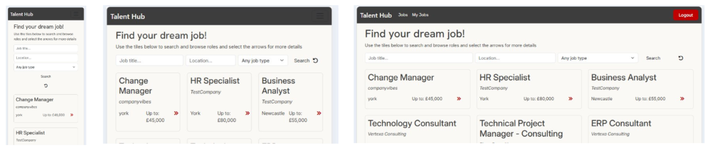

For a job details page: 

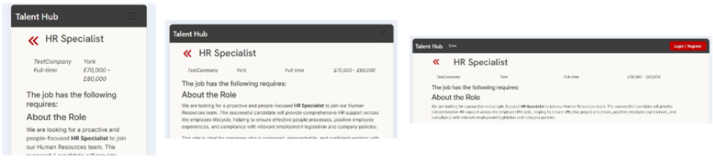

For a company dashboard: 

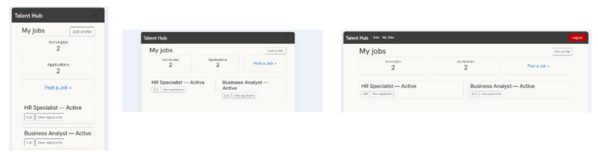

For a job specific dashboard: 

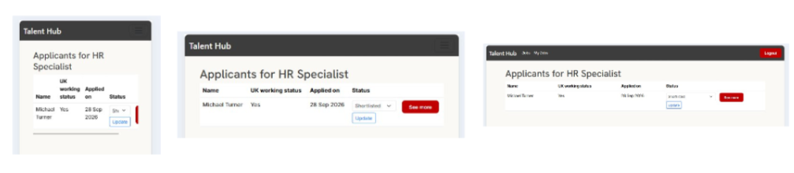

For an applicant dashboard: 

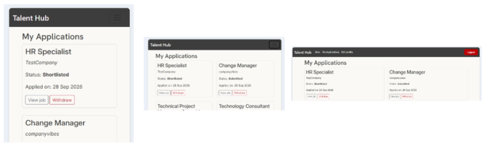

For an edit form: 

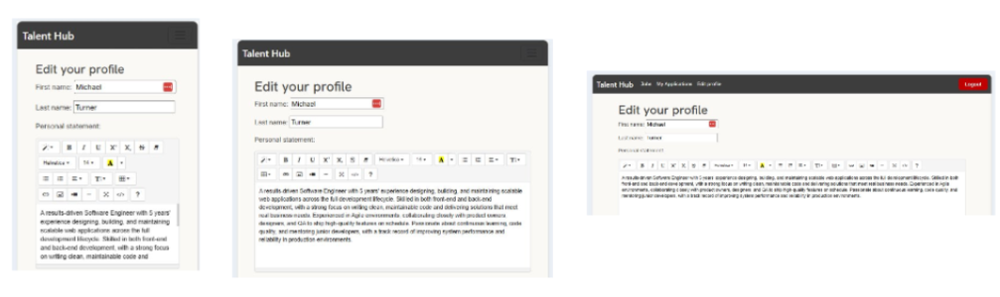

## Lighthouse Testing 
I used the developer lighthouse tool testing to ensure my website is loading efficiently, is accessible, follows best practice and is optimised via search engine optimisation. The outcomes are shown below. 

For the home page: 

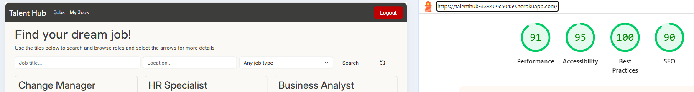

For a job details page: 

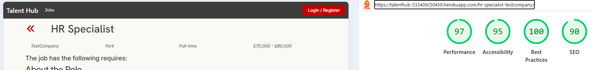

For a company dashboard: 

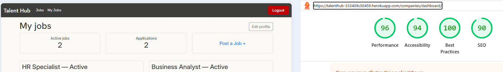

For a job specific dashboard: 

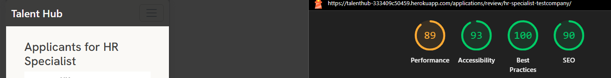

For an applicant dashbnoard: 

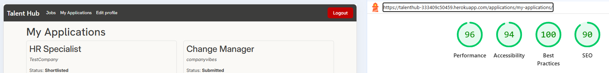

For an edit form: 

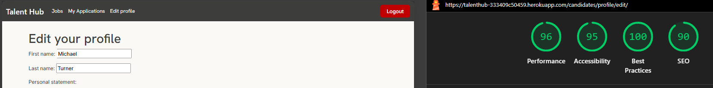

_Please note, two of the screenshots were done in incognito mode due to caching problems hence the change in background colour._

## HTML Testing
Using the [HTML Validator](https://validator.w3.org/), I tested each page and have the following results.

For the home page, there are no errrors:

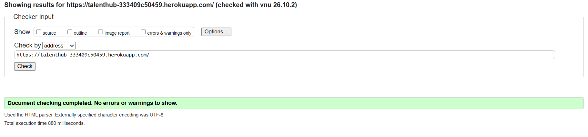

For a job details page, there is one error about a closing paragraph element tag however this is due to the user input in summer note which I have no control over. 

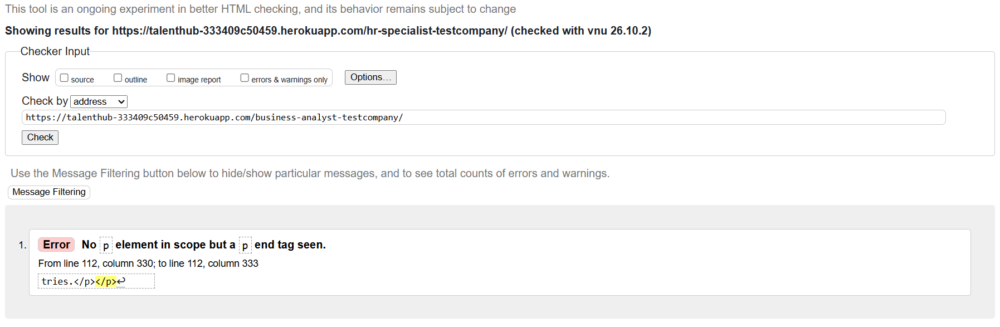

For a company dashboard, there are no errors:

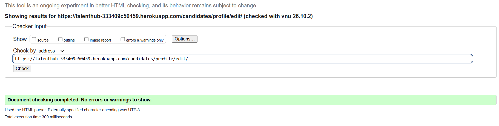

For a job specific dashboard, there are no errors:

For an applicant dashbnoard, there are no errors: 

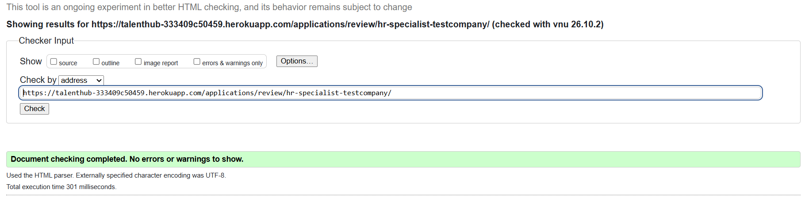

For an edit form, there are no errors:

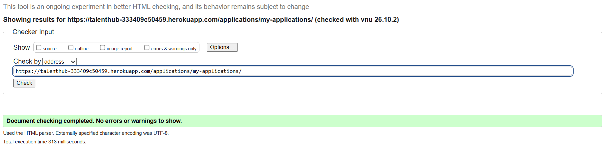

## CSS Tetsing
Using the [CSS Validator](https://jigsaw.w3.org/css-validator/), I have no recorded errors and no warnings. 

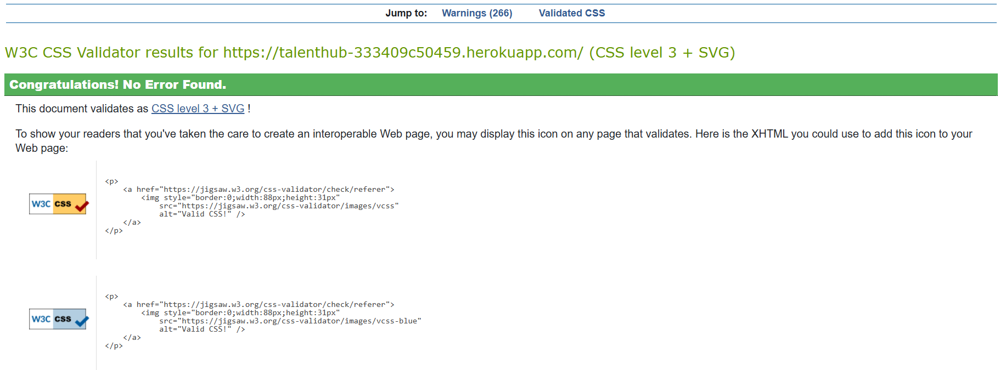

## Django TestCase 
I have used the Django testing framework on two of the four applications in this project. 

### Jobs Testing
The following tests have been ran and passed for the jobs application: 

1. An anonmyous visitor should be redirected to login when navigating to the job posting form
2. A logged in candidate user is denied access to the job posting form
3. A logged in company user can access the job posting form
4. A logged in company user can access the edit job form for its own job listings 
5. A logged in company user cannot edit the job of a different company 
6. A job marked as 'not active' is not displayed on the home page or accessible via URL
7. A job marked as 'active' is displayed on the home page 

### Applications Testing
The following tests have been ran and passed for the applications application: 

1. A logged in company user cannot apply to a job listing 
2. A logged in candidate user can apply for a job 
3. A logged in candidate user cannot apply for the same job twice 
4. A logged in company user can view the application list for its own job 
5. A logged in company user can only see applications for their own job listings 
6. Withdrawing an application marks it as withdrawn, but keeps the datarow
7. A logged in candidate user cannot withdraw another candidates application 